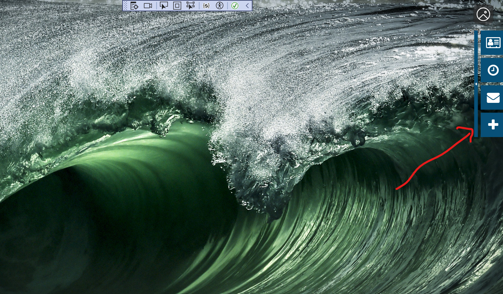
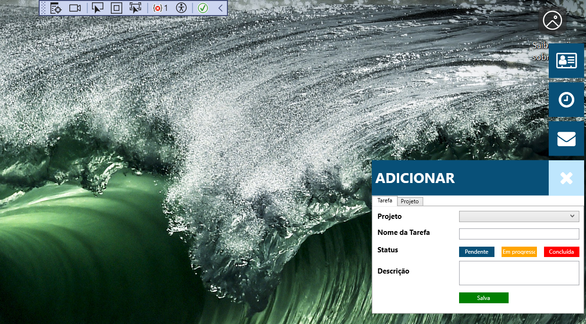

# TaskManager WPF Application

## Descrição
Este é um aplicativo WPF para gerenciar tarefas, desenvolvido usando C# e .NET. Este README fornece instruções para configurar o ambiente de desenvolvimento, implantar a aplicação e executar o aplicativo.


## Screenshot



## Pré-requisitos
- [Visual Studio 2019 ou superior](https://visualstudio.microsoft.com/)
- [.NET framework 4.8 ou superior](https://dotnet.microsoft.com/download)
- [.NET SDK 6.0 ou superior](https://dotnet.microsoft.com/download)
- [Git](https://git-scm.com/)

## Configuração do Ambiente

### Clonar o Repositório
```sh
git clone https://github.com/ManoelCod/TaskManager.git
cd TaskManager
